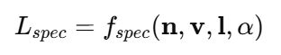

# [Study 2. 도진경] BecomingLit: Relightable Gaussian Avatars with Hybrid Neural Shading (1)

- Title) BecomingLit: Relightable Gaussian Avatars with Hybrid Neural Shading
- Publication) NeurIPS 2025
- Reference)
    - [project page](https://jonathsch.github.io/becominglit/) | [github](https://github.com/jonathsch/becominglit) | [paper](https://arxiv.org/pdf/2506.06271)

# Abstract

- 고해상도의 3D Avatar 생성
    - 3D Gaussian primitive 기반의 relightable avatar 생성
    - hybrid neural shading 방법 사용하여 realistic relighting 구현
        - neural diffuse BRDF + 분석적 specular term 결합
- 다양한 조명/ 표정의 face dataset 수집

---

1. Representation
: FLAME - 얼굴 motion, pose, texture 표현
: Gaussian head avatar / Parametric expression model
2. Shading
: 조명 변화를 얼굴에 표현
    1. Hybrid neural shading 
        1. neural diffuse
        2. analytic specular

---

# 1. Introduction

- 3D 아바타에 새로운 환경의 조명을 적용해서 재구성하기 어려움.
    - 다양한 각도에서의 빛 정보가 있는 dataset이 없기 때문
1. **OLAT 데이터셋 제안**
    - 다양한 각도에서 빛을 비추는 이미지 데이터
    - 고해상도, 높은 frame rate, 다양한 인물
2. **Relightable, Realistic 아바타 표현 방법 제안**
    - 3D Gaussian primitives 기반 아바타 표현
        - 빛과 색의 자연스러운 표현 (Gaussian)
        - 얼굴 표정/움직임의 자연스러운 표현 (Parametric head model + expression dynamics module)
    - Hybrid Neural Shading 기반 고품질의 조명 표현
        - neural diffuse BRDF: diffuse reflection(확산 반사) 학습
        - analytical specular term: specular(반사광)을 물리 기반 모델로 분석

## 2. Related Works

- Human Head Modeling
    - **PCA-based 3DMM**
    : 피부 주름 / 머리카락 등 디테일 표현 부족
    - **NeRF**
    : 고해상도 표현 가능, geometry 추론 모델 불필요
    : relighting 어려움, 연산량↑
    - **3D Gaussian Primitives**
    : 상대적으로 높은 geometry 품질, 빠른 렌더링 지원
    : but, 제한적인 relighting
    
    **→ 3D Gaussian Primitives에 material-aware shading을 결합**
    
- Facial Appearance Capture & Neural Shading
    - 새로운 각도의 조명과 피부의 반사 표현 어려움
    : 고주파 reflection 시 아티팩트 발생
    
    **→ diffuse는 neural +specular는 analytic specular 사용한 Hybrid Neural Shading 적용**
    

## 3. Multi-View OLAT Dataset of Faces

- One-Light-At-a-Time
    - 조명·시점·표정이 분리된 얼굴 데이터셋 구축
- diffuse와 specular를 분리하여 사용
    - diffuse
    : 방향 변화에 완만히 변함, 학습 가능
    - specular
    : 특정 방향에서 급격히 반응
- Specular 반사의 특징
    - 방향 의존적이며, 고주파 신호
        - 표면 노멀 n
        - 시점 방향 v
        - 광원 방향 l
    
    
    

## 4. Method

### 4.1 관련 원리

### 3D Gaussian Splatting

- 평균, 공분산, 불투명도로 3D 씬을 표현
    - 표면/볼륨 특징의 효율적인 표현 가능 (피부,머리카락,경계 표현)

### Physically-based Rendering

- 카메라 센서에 빛이 들어오는 물리적 특성에 따른 이미지 렌더링 공식 적용
    - 특정 지점에 입사하는 빛(wi)이 관찰자 방향(wo)으로 얼마나 반사되는지 결정
    - Lo: 카메라에 관찰된 반사적 특징
    - Li: 새로운 조명 환경, x 포인트에서 wi 방향으로 들어온 빛의 L
    - fr: 복원하고자 하는 아바타의 metarial 정보

### 4.2 Geometry

- 어느 위치에 Gaussian 점이 위치하는가 를 정의

1. 얼굴로부터 **FLAME 파라미터 추출**
2. FLAME 파라미터를 사용하여 **gaussian 특성을 변형**
3. Fg Renderer를 통해 **Gaussian 특성을 2D UV map으로 projection**

1. 표정/포즈 변화 시, Gaussiㅇan Deformation으로 얼굴 구현

---

### 4.3 Material

| 항목 | Diffuse | Specular |
| --- | --- | --- |
| 계산 방식 | Fd 네트워크 | 수식 |
| 위치 결정 | neural | analytic |
| 방향성 | 약함 | 매우 강함 |
| 안정성 | 높음 | 매우 높음 |
| relighting | 제한 | 매우 강함 |
- **Neural Diffuse (Fd 네트워크 추정)**
    - 빛이 오는 방향, point의 재질에 따른 피부 표현을 함수로 학습
    - 저주파적 특성
- **Analytic Specular (물리적 정의 + Fv 네트워크 추정)**
    - view point와 빛의 방향에 따른 하이라이트(반사)의 위치와 세기를 정의
    - 고주파적 특성
        - **물리 기반 specular 함수**
            - 하이라이트가 생기는 **위치와 방향**을 정의
            - ‘ 이 방향에서 빛이 오고, 이 방향에서 바라볼 때, 표면이 이 정도로 매끄러우면 하이라이트가 여기 생긴다’
            - 광원 방향 / 시점 방향 / 표면 노멀 의 정확한 기하 관계로 결정됨
        - **Fv 네트워크**
            - microfacet BRDF
            - view point에 따른 reflection의 세기, 미묘한 view-dependent 변화만 Fv 네트워크로 보정

---

---

### 4.4 Optimization

- 렌더링 결과 ≒ 실제 이미지가 되도록 최적화
    
    
    
- Loss function
    - **L_rgb**
    : Photometric Loss, 렌더링 결과와 실제 OLAT 이미지 간 색 차이
        - diffuse 학습(Fd) , specular 세기 조정(Fv), Gaussian geometry 미세 보정
    - **L_reg**
    : Gaussian geometry을 물리적으로 바르게 유지함.
        - L_normal
        : Gaussian이 proxy geometry(FLAME)의 normal을 벗어나지 않게 고정
        - L_alpha
        : Gaussian의 불투명도
        - L_scale
        : Gaussian의 크기/모양을 초기값으로 유지, specular 안정성 확보
        - L_pos
        : Gaussian의 3D 위치 가 mesh 표면에 있도록 유지
        - 감마가 커지면 표현력 제한, 너무 작으면 붕괴

### 4.5 Implementation Details

- PyTorch + 커스텀 GPU 커널 (SLANG.D)
- Specular shading
: 커스텀 GPU 커널 (SLANG.D)
: 높은 성능, 정확도
- Gaussian Rendering
: gsplat 사용
: 실시간에 가까운 처리 속도
- 512x512 texel 해상도
: 20만개의 gaussian 점으로 표현
- FLAME 2023 + 치아 추가
- 학습 해상도·시간·하드웨어
: 1100×1604, 250k iterations, batch size 4, ~30 hours on RTX A6000

### 4.6 Differences to RGCA

- RGCA
    - VAE 기반
    - 특정 identity 의 사람에 대한 latent space 추출 및 추정 
    (사람마다 encoder 재학습 필요)
    - 한 사람을 잘 표현하는 목적으로 사용
- BecomingLit
    - FLAME 기반 공통 expression space 사용 
    (모든 얼굴에 사용 가능한 공통된 표정 파라미터 표현)
    - general하게 조명·표정·시점을 바꿀 수 있는 아바타 생성

## 5. Experiments

- 한계
    - 새로운 identity의 아바타 생성을 위해 OLAT 데이터 생성 + 재학습 필요
- 제안한 Gaussian + Hybrid Neural Shading 방식이 안정적,사실적 표현 가능
(1) 재조명, (2) 시점 변경, (3) 애니메이션 측면
- [Figure 4] Relighting 결과 비교
    - 하이라이트 위치 정확도 ▲
    - 자연스러운 하이라이트 표현
    - 조명 변화에 independent한 얼굴 색
    : diffuse(얼굴 고유 색) 와 specular(조명 방향에 따른 반사 방향) 분리
- [Figure 5] Comparison of Intrinsic Decomposition
    - 성분별 분리 및 표현 정확도
- [Figure 7]
    - (Left) 다양한 방향, 세기의 광원이 존재하는 environment map에서의 높은 품질 확보
    - (Right) (2) 단일 영상(monocular video)만으로도 애니메이션 가능