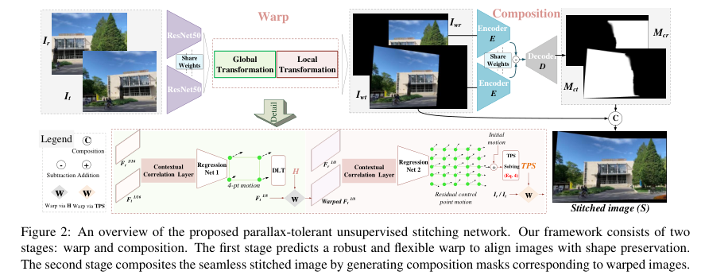
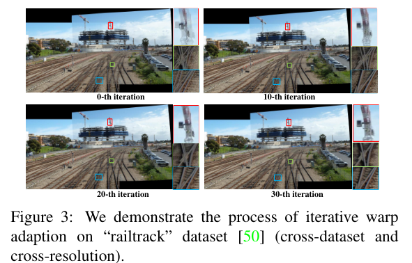
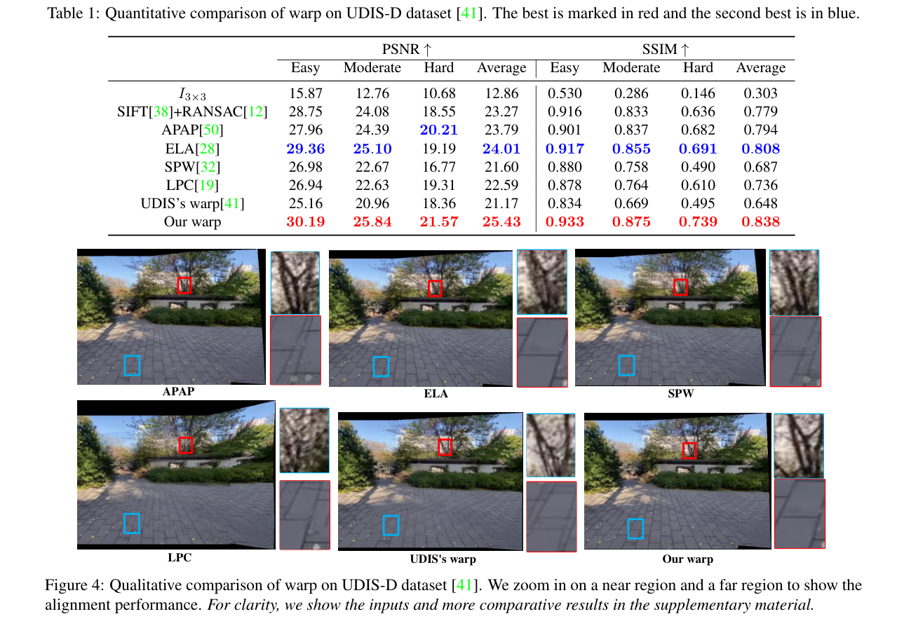
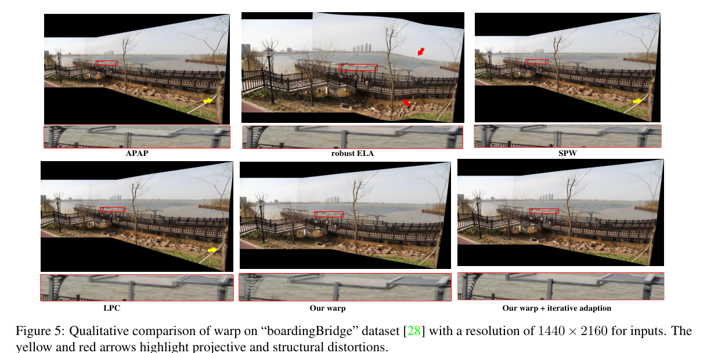
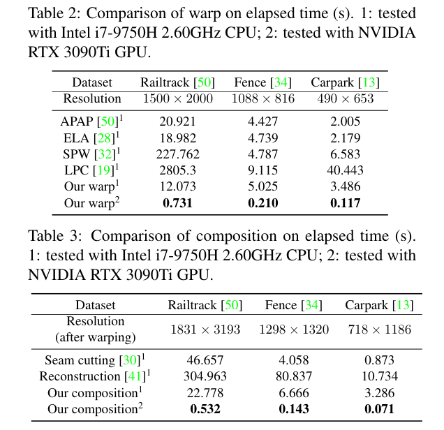
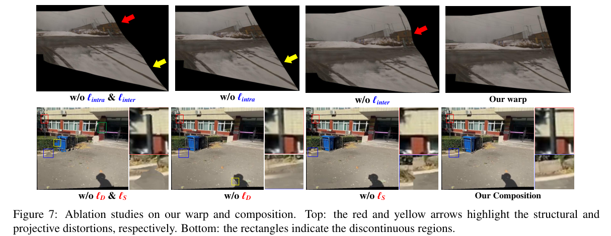

# [Study 12.도진경] Parallax-Tolerant Unsupervised Deep Image Stitching

+ [Title] Parallax-Tolerant Unsupervised Deep Image Stitching
+ [Publication] 2023 (ICCV 2023)
+ [Reference] [paper](https://arxiv.org/abs/2302.08207) | [github](https://github.com/nie-lang/UDIS2)

## Abstract

+ Deep Stitching 기반 robust semantic feature 분석
+ large parallax case 대응을 위한 방법 제시   - Warp: Global Homography와 TPS를 모델링, 중첩 영역은 align / 겹치지 않는 영역의 형태 보존
  - iterative warping: 다른 환경/해상도에서의 generalization 확보
  - seam-driven composition mask 생성을 위한 unsupervised learning.

## 개요
+ Traditional Stitching
    + Feature Extract / Matching   : SIFT, Line, Edge, Depth, ...
    + Low Texture, 다양한 영상 활용 어려움.
    + 낮은 추론 속도
+ CNN-based Deep Stitching
    + low texture 환경에 robust
    + large parallax 대응 어려움
    + 학습 데이터 이외의 환경/해상도에서 낮은 성능
+ Proposed
    + Global Homography와 TPS 추정
     : 전체적으로는 이만큼(Homography), 세부적으로는 요만큼(TPS) 움직인다.  
    : 전체적인 틀(Global)과 세부적인 비틀림(Local)을 동시에 고려하기 때문에, 한 대상에만 맞췄을 때 발생하는 오차(예: 배경은 맞는데 앞쪽 물체는 어긋나는 현상)를 줄일 수 있다.
    + Seam composition 시 ghost 현상 개선

 

## Method
> 

$$\left(
    S = M_{cr} \times I_{wr} + M_{ct} \times I_{wt}
\right)$$
### Unsupervised Warp
> · Warp Parameterization 
1) Homography: 8개 자유도(translation|rotation|scale|shear 등) 로 표현 -> DLT 사용, 3x3 행렬로 변환
 *DLT: 대응되는 4개 pt 기반 Homography 계산

2) TPS
 : NxV 개의 point 지정, 각 point의 이동량$$(\Delta p)$$을 예측, 최종 warped 좌표 $$P'$$ 추정
 : Parameterization) TPS 수식 내 변환 계수(C,M,W) 계산
 : Warping) C,M,W를 사용해서 모든 픽셀이 어느 위치로 이동하는지 계산.
$$\left(
p' = \mathcal{T}(p) = C + Mp + \sum_{i=1}^{N} w_i O(\| p - p_i \|_2)
\right)$$
+ $M$ (Affine Part): 이미지의 선형 변환 (회전/크기)
+ $C$ (Translation): 평행 이동
+ $W$ (Non-linear Part): 비선형 왜곡 계수, point 주변을 늘리거나 맞춤.

> · Pipeline of Warp
> : ResNet50 사용 → feature 계산
> : 1/16 feature map으로 point 이동량 계산 → 초기 homography 계산
> : 1/8 feature map으로 세부 이동량 계산 → TPS 계산
1) ResNet50을 backbone으로 사용
 : semantic feature 추출 

2) 1/16 feature 기반 Contextual Correlation 계산
   : Homography 추정에 어떤 영역에 어느 정도의 가중치를 둘 지 판단.
   : $$F_{1/16}$$ → Regression Network → 4-pt parameterization
3) 1/8 feature 기반 Coarse-to-Fine Refinement
    + 1/16 에서 예측된 호모그래피(Global Warp)를 tgt 1/8 feature에 적용
    + ref 1/8 feature가 warped tgt 1/8 feature의 어느 point로 매칭되는지 계산, 포인트의 미세 조정값 출력 → TPS 계산

> · Warp 최적화
> : content alignment and shape preservation 

$$\left(
\mathcal{L}^w = \mathcal{L}^w_{\text{alignment}} + \omega \mathcal{L}^w_{\text{distortion}}
\right)$$

#### Alignment Loss
$$\left(
\begin{align*}
\mathcal{L}^{w}_{\text{alignment}} &= \lambda \| I_r \cdot \varphi(\mathbf{1}, \mathcal{H}) - \varphi(I_t, \mathcal{H}) \|_1 + \\
&\quad \lambda \| I_t \cdot \varphi(\mathbf{1}, \mathcal{H}^{-1}) - \varphi(I_r, \mathcal{H}^{-1}) \|_1 + \\
&\quad \| I_r \cdot \varphi(\mathbf{1}, \mathit{TPS}) - \varphi(I_t, \mathit{TPS}) \|_1 ,
\end{align*}
\right)$$
+ $$H, \mathcal{H}^{-1}$$: 초기 Homography 기반 정렬 시 오차를 양방향으로 줄임.
+ $$\mathit{TPS} $$: TPS 정렬 시 오차 줄임.

#### Distortion Loss

<figure>
  
  <figcaption align="center"><i>Deep Rectangling for Image Stitching: A Learning Baseline (CVPR 2022)</i></figcaption>
</figure>

+ Inter-grid Constraint, $\ell_{inter}$
    + 목적: 겹치지 않는 영역의 모양 유지
    + 방법: 연속된 두 선분($\vec{e}_{s1}, \vec{e}_{s2}$)이 일직선($180^\circ$)을 유지
    + Cosine Similarity: 두 선분 사이의 각도가 커지면(내적이 1에서 멀어지면) penalty
    + 핵심 포인트 ($S_{s1,s2}$): 미중첩 영역에만 적용. 겹치는 영역에서는 정렬을 위해 선이 휘어질 수 있어야 하기 때문

+ Intra-grid Constraint, $\ell_{intra}$
    + 목적: mesh가 너무 과하게 늘어나거나 줄어드는 **Projective Distortion** 방지
    + 방법: 격자의 가로/세로 선분($\vec{e}$)의 길이 비교
    + $ReLU$: 선분의 길이가 임계값(이미지 크기를 격자 수로 나눈 평균 길이)을 넘어서면 Penalty
    + : 격자 모양이 급격하게 커지는 것을 막아 이미지의 해상도 깨짐 방지

### Unsupervised Seamless Composition
> · Motivation 
+ 기존 방식의 한계 극복
    + Seam Cutting: pixel의 밝기 차이에 의존, 무거운 연산
    + Deep Learning 기반, 0~1 사이의 실수 값을 갖는 Soft Mask를 추정 (학습 가능한 형태)

> · Pipeline of Composition 
+ UNet 구조 사용
1) Shared Weights Encoder
 : warped Image(ref, tgt)에서 semantic feature 추출

2) Skip Connection
 : 두 feature의 residual을 계산, decoder에 적용 - 두 이미지의 차이를 학습

3) Mask Prediction
 : Sigmoid 함수를 사용, 0~1 사이의 값을 갖는 mask 생성

> · Optimization of Composition 

+ boundary term and a smoothness term 

1) boundary term
: 경계의 시작-끝 지점을 지정
: 마스크의 경계가 갑자기 끊기지 않고 부드러워야 함.
: 두 이미지가 겹치는 영역의 맨 끝 경계선($M_{br}, M_{bt}$)에서, 합성 이미지($S$)가 각각 원래 이미지($I_{wr}, I_{wt}$)와 똑같아야 한다.

2) Smoothness Loss
    + seam 이 지나가는 경로를 추정
    + Smoothness on Difference Map ($\ell_D$)
    : 두 이미지의 픽셀 값 차이가 큰 곳($D$)에서는 마스크의 급격한 변화 X
    : 두 이미지가 서로 다르게 생긴 곳은 경계로 정하지 않는다.
    
    + Smoothness on Stitched Map ($\ell_S$)
    : 최종 결과물($S$)에서 seam 주변 픽셀들이 부드럽게 이어지도록 한다.
 

### Iterative Warp Adaption
\[\mathcal{L}^w_{\text{adaption}} = \left\| I_r \cdot \varphi(1, \mathcal{TPS}) - \varphi(I_t, \mathcal{TPS}) \right\|_1\]
+ 비학습 환경/데이터셋에서도 적용 가능하도록 self-optimization
: TPS 조정을 위한 학습만 반복 진행
: 학습 횟수가 늘어날수록 artifact 감소

## Experiments

+ Fig 3. Iterative 반복될수록 artifact 제거, 오차 줄어듦.

+ Fig 4. 깊이차가 발생하는 대상의 alignment 및 seam 성능 비교

+ Fig 5. 타 데이터셋에 대한 성능 비교

+ Table 2. GPU 가속 사용 가능, 비선형 warping 발생 시 traditional method의 속도 느려짐.

+ Ablation studies on our warp and composition 
    + $$\ell_{inter}$$ (그리드 간 제약): 없으면 겹치지 않는 배경 영역의 구조 변형됨.
    + $$\ell_{intra}$$ (그리드 내부 제약): 없으면 심한 왜곡(Projective Distortion) 발생.